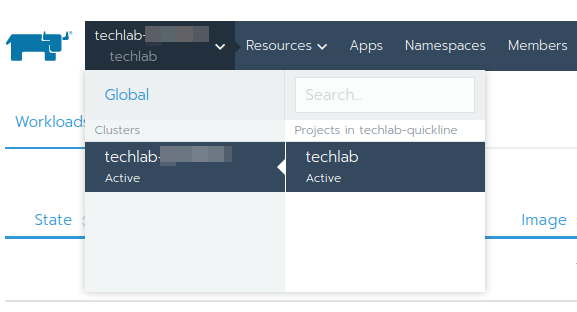

In this excercise we will interact for the first time with the lab environment, both with `kubectl` as well as via web console.

{}
Please make sure, the be finshed with [Lab 2](../02.0/) before continue with this lab.
{}


### Login and choose Kubernetes Cluster


Our Kubernetes cluster of the techlab environment runs on [cloudscale.ch](https://cloudscale.ch) (a swiss IaaS Provider) and has been provisioned with [Rancher](https://rancher.com/). You can login into the cluster with a Rancher user.

{}
For details about your credentials to log in, ask your teacher.
{}



Login into the Rancher WebGUI choose the desired cluster.

On the cluster dashboard you find top right a button with `Kubeconfig File`. Save the config file into your homedirectory `.kube/config`. Verify afterwards if `kubectl` works correctly e.g. with `kubectl version`


{}
If you already have a kubeconfig file, you might need to merge the Rancher entries with yours. Or use the KUBECONFIG environment variable to specify a dedicated file.
{}

```
#example location ~/.kube-techlab/config
vim ~/.kube-techlab/config
# paste content

# set KUBECONFIG Environment Variable to the correct file
export KUBECONFIG=$KUBECONFIG:~/.kube-techlab/config
```




## Namespaces

As a first step we are going to create a new namespace.

A namespace is the logical design used in Kubernetes to organize and separate your applications, deployments, pods, ingress, services etc. on a top level base. Take a look at the [Kubernetes docs](https://kubernetes.io/docs/concepts/overview/working-with-objects/namespaces/). Authorized users inside that namespace are able to manage those resources. Namespace names have to be unique in your cluster.


{}
Additionaly Rancher does know the concept of a [project](https://rancher.com/docs/rancher/v2.x/en/cluster-admin/projects-and-namespaces/) which encapsulates multiple namespaces.
{}

In the Rancher WebGUI you can now choose your Project called `techlab`






### Task .1: Create a Namespace

Create a new namespace in the lab environment.

{}
Please choose an identifying name for the namespace, in best case your abbreviation. We are going to use `<NAMESPACE>` as a placeholder for your created namespace.
{}

> How can a new namespace be created?

**Tip** `kubectl` can help you to figure out the right commands:

```bash
kubectl help
```


### Solution

To create a new namespace on your cluster use the following command:

```bash
kubectl create namespace <NAMESPACE>
```


{}
Namespaces created via `kubectl`, have to be assigned to your Rancher project in order to be seen inside the Rancher WebGUI. Ask your teacher for the assignement. Or you can create the namespace directlly within the Rancher WebGui
{}


**Tip:** By using the following command, you can switch into another namespace instead of specifly the namespace in each `kubectl` command:

```bash
# Linux:
kubectl config set-context $(kubectl config current-context) --namespace=<NAMESPACE>
```

```
# Windows:
kubectl config current-context
// Save the context in a variable
SET KUBE_CONTEXT=[Insert output of the upper command]
kubectl config set-context %KUBE_CONTEXT% --namespace=<NAMESPACE>
```

{}
Some prefer to explicitly select the namespace for each `kubectl` command by adding `--namespace <NAMESPACE>`
or `-n <NAMESPACE>`. And others prefer helper tools like `kubens` (see lab 2)
{}


## Task .2: discover the web console

Check the menu entries, there should neither appear any deployments nor any pods or services in your namespace.

Display all existing pods in the previously created namespace with `kubectl`  (there should not yet be any!):

```bash
kubectl get pod -n=<NAMESPACE>
```

With the command `kubectl get` you can display all kinds of resources of different types.
